<div align="center">

# 👨‍💻 Sacha Crelier

### Développeur Full-Stack • SysAdmin

[](https://sachacrelier.ovh)
[](mailto:contact@sachacrelier.ovh)

---

</div>

## 🎯 À Propos

Dev full-stack basé en France. Je fais du frontend moderne, du backend solide et je gère mes propres serveurs.

**Mon truc :** Coder vite, bien et sans prise de tête.

---

## ⚡ Expertise Technique

<table>
<tr>
<td width="50%" valign="top">

### 🎨 Frontend & Design

```javascript
const frontend = {
  frameworks: ['Vue.js', 'React', 'Nuxt.js'],
  styling: ['Tailwind CSS', 'CSS3', 'SASS'],
  design: ['Figma', 'Design Systems', 'UI/UX'],
  state: ['Vuex', 'Pinia', 'Redux']
}
```

<div align="center">
  


</div>

</td>
<td width="50%" valign="top">

### ⚙️ Backend & APIs

```javascript
const backend = {
  runtime: ['Node.js', 'Express.js'],
  databases: ['PostgreSQL', 'MySQL', 'SQLite', 'MongoDB'],
  apis: ['RESTful', 'WebSockets', 'GraphQL'],
  auth: ['JWT', 'OAuth', 'Session']
}
```

<div align="center">


</div>

</td>
</tr>
<tr>
<td width="50%" valign="top">

### 🚀 DevOps & Cloud

```bash
- Docker & Conteneurisation
- Nginx & Load Balancing
- CI/CD & Automatisation
- Monitoring (PM2, Grafana, Netdata)
```

<div align="center">


</div>

</td>
<td width="50%" valign="top">

### 🔧 Outils & Méthodologies

```python
tools = {
    'automation': ['Python', 'Bash Scripts'],
    'security': ['SSL/TLS', 'Firewalls', 'SSH'],
    'workflow': ['Git Flow', 'Agile', 'Code Review'],
    'systems': ['Ubuntu', 'Debian', 'CentOS']
}
```

<div align="center">


</div>

</td>
</tr>
</table>

---

## 🏗️ Architecture & Méthodologie

```mermaid
graph LR
    A[💡 Conception] --> B[🎨 Design UI/UX]
    B --> C[⚡ Développement]
    C --> D[🧪 Tests]
    D --> E[🚀 Déploiement]
    E --> F[📊 Monitoring]
    F --> A
```

<div align="center">



</div>

**Approche :** Je découpe proprement • J'optimise quand c'est nécessaire • Je sécurise par défaut

---

## 📊 Activité GitHub

<div align="center">
  


</div>

---

## 🌟 Mon Approche

<div align="center">

| 💎 Clarté | 🚀 Efficacité | 🔒 Sécurité
|:----------:|:--------------:|:-----------:|
| Code lisible | Pas de sur-optimisation | Bonnes pratiques |

</div>

---

## 🤝 Projets Open Source

Si vous bossez sur un truc cool, n'hésitez pas à me contacter :

- 🌐 Applications web avec stack moderne
- 🔧 Automatisation et scripts
- 🎨 Interface sympa + backend
- 🛡️ Infrastructure qui tient la charge

---

<div align="center">

### 💬 On discute ?

[](mailto:contact@sachacrelier.ovh)
[](https://sachacrelier.ovh)

---

*⭐️ Jette un œil à mes repos, y'a peut-être un truc qui t'intéresse !*

</div>